# SyncMyCalls: Call Log Manager


**SyncMyCalls** is an open-source Android application built with Kotlin, designed to manage and analyze call logs with a user-friendly interface. Created by a passionate developer, this app allows users to view, filter, export, and analyze call history seamlessly. As an open-source project, SyncMyCalls welcomes contributions from the community to enhance its features and functionality.

## Table of Contents
- [About the Project](#about-the-project)
- [Features](#features)
- [Screenshots](#screenshots)
- [Installation](#installation)
- [Usage](#usage)
- [Permissions](#permissions)
- [Technologies Used](#technologies-used)
- [Contributing](#contributing)
- [Contact](#contact)
- [Coming Soon](#coming-soon)

## About the Project
SyncMyCalls is a passion project crafted to provide Android users with a powerful tool to manage their call logs. Whether you're tracking communication patterns, generating reports, or analyzing call statistics, SyncMyCalls offers a robust solution with a clean, modern design. 

## Features
- **View Call Logs**: Display call logs grouped by date, showing details like name, phone number, duration, call type, and timestamp.
- **Filter Call Logs**: Filter logs by:
  - Call types (Incoming, Outgoing, Missed, Rejected, Blocked).
  - Specific phone numbers.
  - Custom or predefined date ranges (e.g., Today, Yesterday, Past Month).
- **Analytics Dashboard**: Gain insights with:
  - Total calls by type (Made, Rejected, Missed, Blocked).
  - Average and longest call durations.
  - Pie chart comparing incoming and outgoing calls.
  - Most-called and most-received numbers.
- **Export Call Logs**: Download call logs as a CSV file for use in spreadsheet applications.
- **Share Call Logs**: Share call logs via email, messaging apps, or other platforms in CSV format.
- **Open-Source**: Freely explore, modify, and contribute to the codebase.
- **Theme Support**: Adapts to light and dark themes for a consistent user experience.
- **Permission Handling**: User-friendly dialogs for managing call log and storage permissions.

## Screenshots
Here are some glimpses of SyncMyCalls in action:

### Light Mode
<table>
  <tr>
    <td>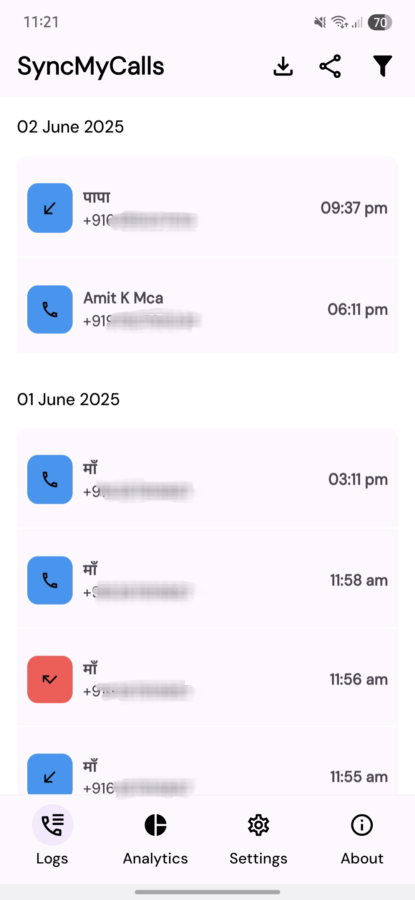</td>
    <td>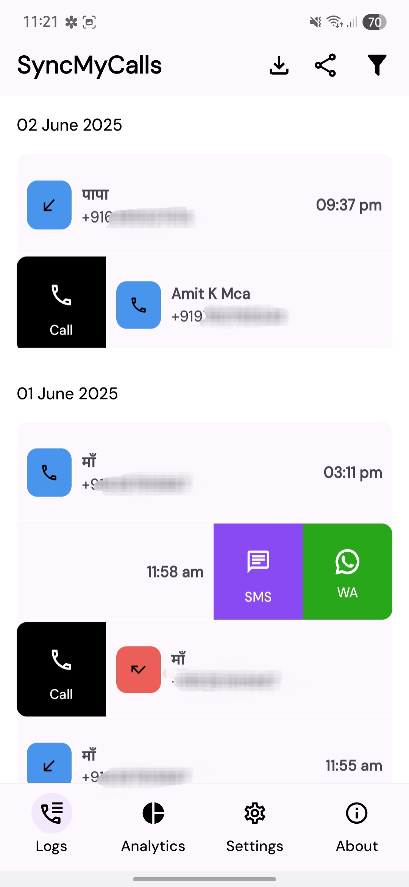</td>
    <td>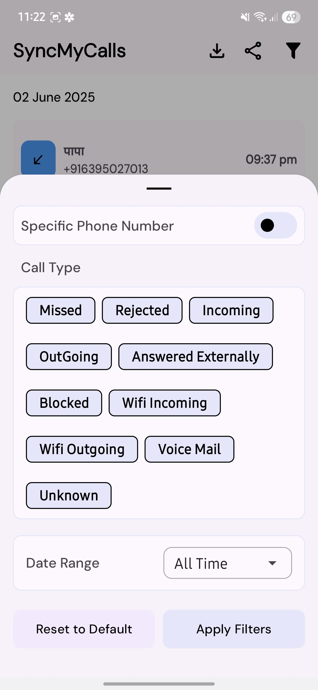</td>
  </tr>
  <tr>
    <td>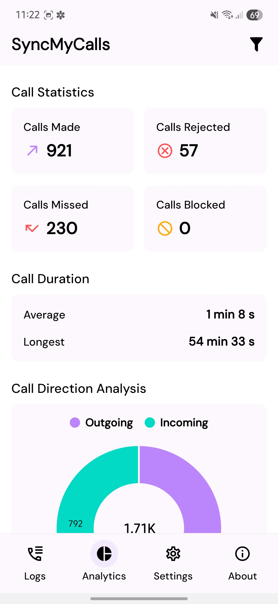</td>
    <td>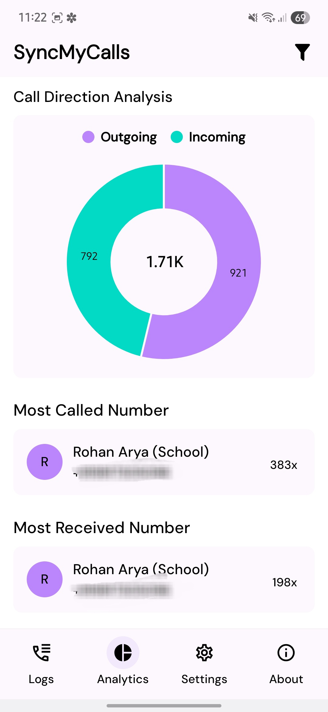</td>
    <td>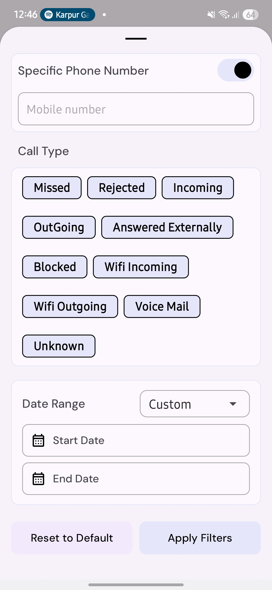</td>
  </tr>
</table>

### Dark Mode
<table>
  <tr>
    <td>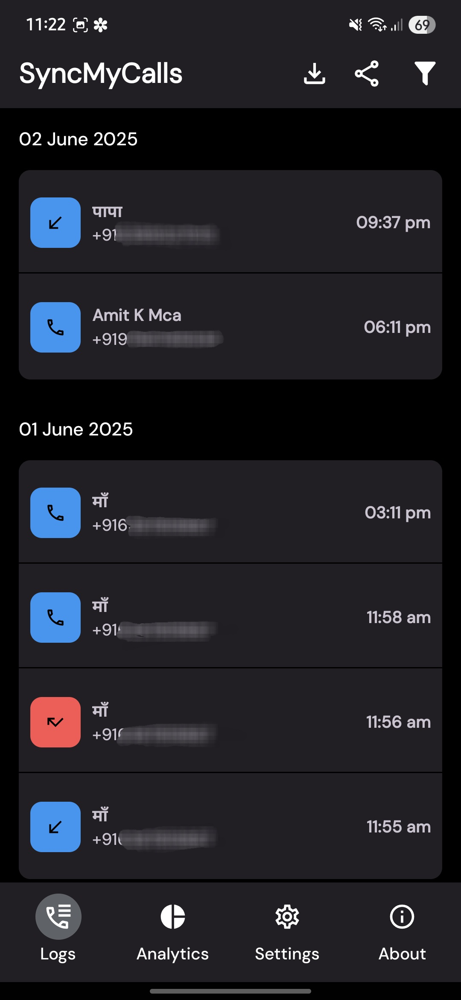</td>
    <td>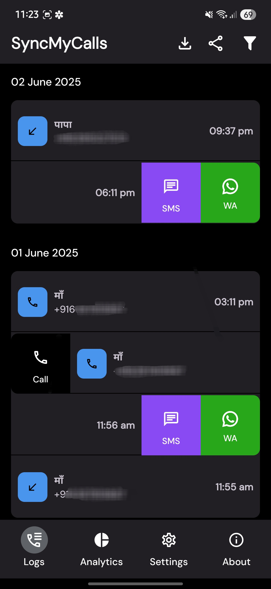</td>
    <td>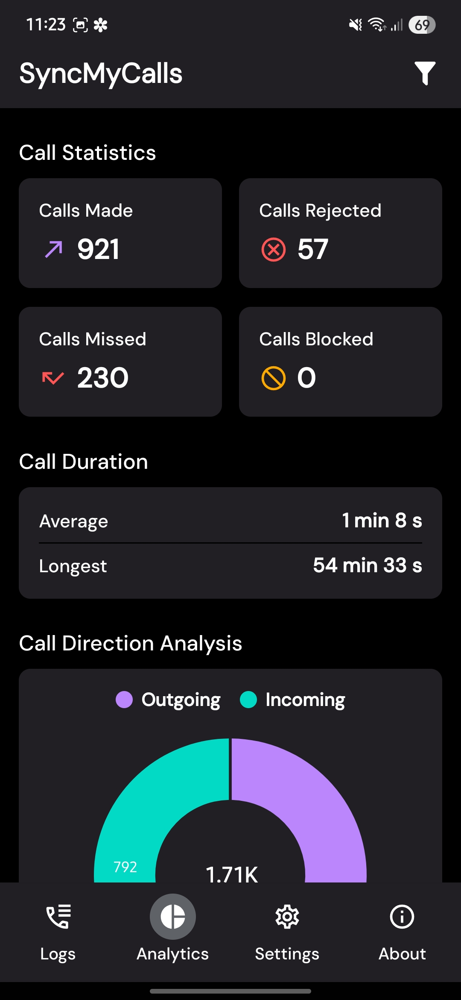</td>
  </tr>
  <tr>
    <td>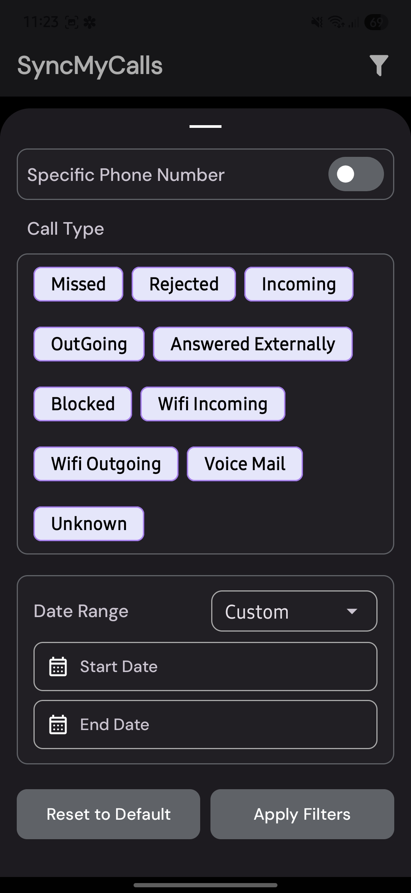</td>
    <td>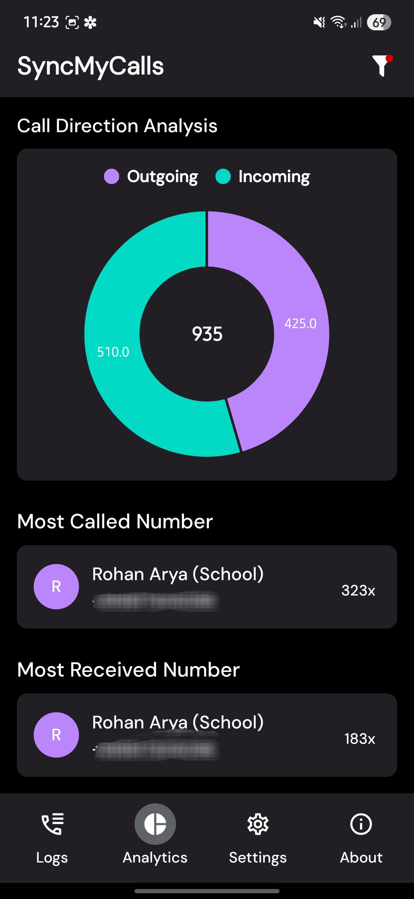</td>
    <td></td>
  </tr>
</table>

## Installation
### Prerequisites
- Android device running **Android 6.0 (API 23)** or higher.
- Enable **Unknown Sources** in your device settings to install APKs (for debug/release APKs).

### Steps
1. **Download the APK**:
   - Debug APK: `apk_download/app-debug.apk`
   - Release APK: `apk_download/app-release.apk`
2. **Transfer to Device**:
   - Copy the APK to your Android device via USB, email, or cloud storage.
3. **Install the APK**:
   - Open the APK file on your device.
   - Follow the prompts to install, granting necessary permissions.
4. **Launch the App**:
   - Open **SyncMyCalls** from your app drawer.
   - Grant **Call Log** and (if applicable) **Storage** permissions to access features.

### Build from Source
1. Clone the repository:
   ```bash
   git clone https://github.com/Akash616/SyncMyCalls.git
   ```
2. Open the project in **Android Studio**.
3. Sync the project with Gradle.
4. Build and run on an emulator or connected device.

## Usage
1. **View Call Logs**:
   - Open the **Logs** tab to see your call history.
   - Use the pull-to-refresh gesture to update the list.
2. **Apply Filters**:
   - Tap the filter icon in the toolbar to open the filter bottom sheet.
   - Select call types, enter a phone number, or set a date range (e.g., Today, Yesterday, Custom).
   - Apply filters to refine the logs or analytics.
3. **Analyze Calls**:
   - Navigate to the **Analytics** tab to view call statistics and the pie chart.
4. **Export/Share Logs**:
   - In the Logs tab, tap the download icon to save call logs as a CSV file.
   - Tap the share icon to send the CSV file via other apps.
5. **Explore Settings/About**:
   - Use the **Settings** tab to configure preferences.
   - Check the **About** tab for app information.

## Permissions
SyncMyCalls requires the following permissions:
- **READ_CALL_LOG**: To access and display call logs.
- **WRITE_EXTERNAL_STORAGE** (pre-Android 10): To save CSV files to storage.
- The app handles permissions with clear dialogs, guiding users to grant access or navigate to settings if needed.

## Technologies Used
- **Kotlin**: Core programming language for a modern Android experience.
- **Android Jetpack**:
  - Navigation Component for seamless fragment navigation.
  - View Binding for efficient UI interactions.
  - Activity Result API for permission and file operations.
- **MPAndroidChart**: For rendering the pie chart in the Analytics tab.
- **Material Components**: For UI elements like dialogs and bottom sheets.
- **FileProvider**: For secure file sharing.
- **Gradle**: Build system for dependency management.

## Contributing
As an open-source project, SyncMyCalls thrives on community contributions! To contribute:
1. Fork the repository.
2. Create a feature branch (`git checkout -b feature/your-feature`).
3. Commit your changes (`git commit -m 'Add your feature'`).
4. Push to the branch (`git push origin feature/your-feature`).
5. Open a Pull Request with a clear description of your changes.

Please adhere to the project's coding standards and include relevant tests. Contributions can include bug fixes, new features, or documentation improvements.

## Contact
For feedback, questions, or collaboration, reach out:
- **LinkedIn**: [Your LinkedIn Profile](https://www.linkedin.com/in/akash-gupta-114a1b196/)
- **Email**: [your.email@example.com](mailto:616akgupta@gmail.com)

## Coming Soon
New Feature is coming soon!

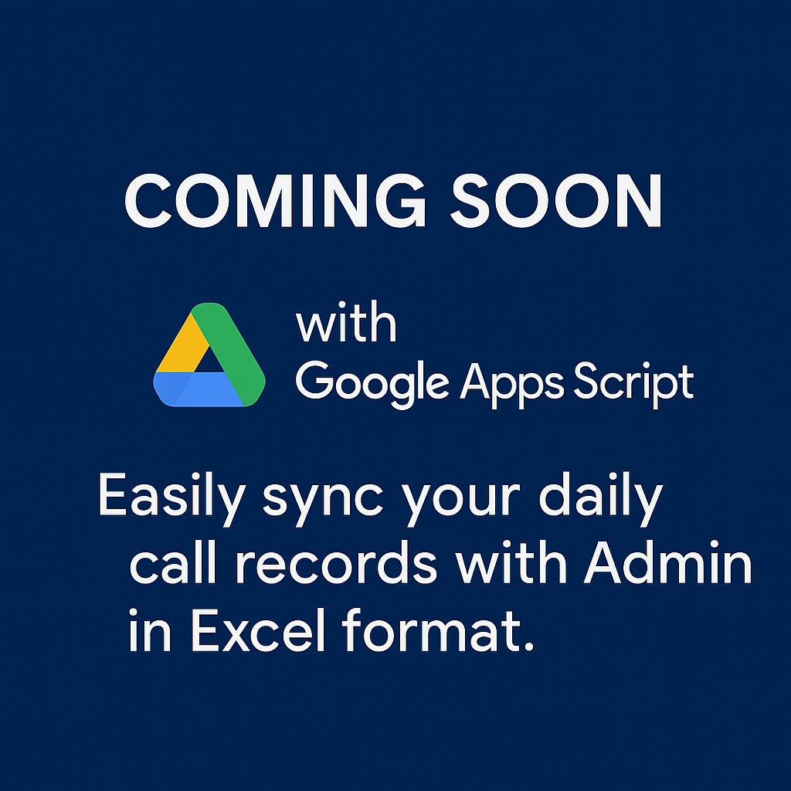
